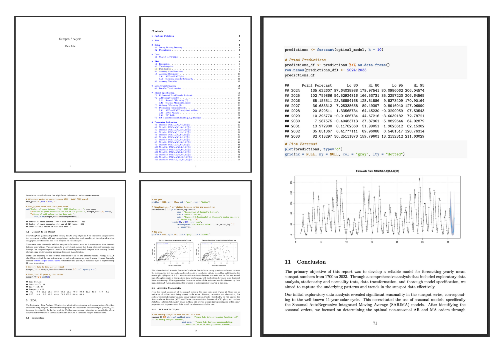
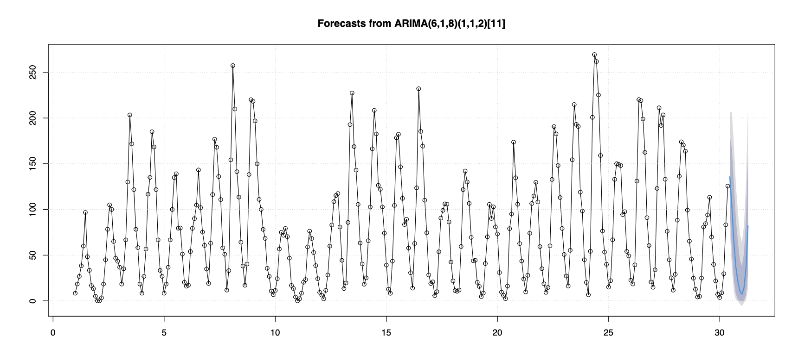

# Sunspot Analysis ☀️

## Problem Definition

The goal of this project is to analyze the yearly mean sunspot numbers dataset from 1700 to 2023. This dataset is obtained from the [Solar Influences Data Analysis Center of the Royal Observatory of Belgium](https://www.sidc.be/SILSO/infosnytot) and represents the yearly mean total sunspot number. Sunspots are temporary phenomena on the Sun's photosphere that appear as darker spots and are crucial for understanding solar cycles with implications for space weather and climate.

## Aim

The primary objectives of this project are:
1. Conduct an initial exploratory data analysis to understand the characteristics, trends, and patterns in the dataset.
2. Propose a set of possible models using various model specification tools such as Autocorrelation Function (ACF), Partial Autocorrelation Function (PACF), Extended Autocorrelation Function (EACF), and Bayesian Information Criterion (BIC) table.
3. Fit all the proposed models to the dataset to obtain parameter estimates and assess their significance.
4. Use goodness-of-fit metrics such as Akaike Information Criterion (AIC), Bayesian Information Criterion (BIC), and Mean Squared Error (MSE) to select the best model.
5. Perform diagnostic checks on the selected model to ensure its adequacy.
6. Forecast future sunspot numbers using the selected model and provide insights based on the analysis.

## Report Preview



## Methodology

The methodology followed in this project includes:
1. **Exploratory Data Analysis (EDA):** Summary statistics, time series plots, and identification of notable features or anomalies.
2. **Model Specification:** Proposing models using tools like ACF, PACF, EACF, and BIC table.
3. **Model Fitting:** Estimating parameters for the proposed models and interpreting their significance.
4. **Model Selection:** Using AIC, BIC, and MSE to select the best-fitting model.
5. **Diagnostic Checks:** Ensuring the adequacy of the selected model through diagnostic tests.
6. **Forecasting:** Using the selected model to forecast future sunspot numbers and provide insights.

## Results

The results section includes the following:
- Summary statistics and visualizations from the EDA.
- Proposed models and their parameter estimates.
- Model selection based on goodness-of-fit metrics.
- Diagnostic checks of the selected model.
- Forecasted sunspot numbers and insights derived from the analysis.



## Conclusion
The conclusion summarizes the key findings of the analysis, the best-fitting model, and the implications of the forecasted sunspot numbers. It also discusses any limitations of the study and suggests directions for future research.

## Usage
To run the analysis and generate the report, follow these steps:

1. Clone the repository.

   ```bash
   git clone https://github.com/Git-With-Chris/SunspotAnalysis.git
   ```

2. Navigate to the project directory.

   ```bash
   cd sunspot-analysis
   ```

3. Install the required dependencies.
   
   ```bash
   Rscript -e "install.packages(c('tidyverse', 'forecast', 'tseries'))"
   ```

4. Run the R Markdown file to generate the report.
   ```bash
   Rscript -e "rmarkdown::render('TSA-A3.Rmd')"
   ```

## Project Structure

```text
.
|-- Images
|   |-- Error_scores_table.png
|   |-- Forecast.png
|   `-- ReportPreview.png
|-- LICENSE.txt
|-- README.md
|-- Resources
|   |-- MonthlySunspotData.csv
|   `-- YearlySunspotData.csv
|-- SunspotAnalysis.Rmd
|-- SunspotAnalysisReport.pdf
`-- utilities.R

3 directories, 10 files
```

## Dependencies

- R (version 4.0 or higher)
- R packages: tidyverse, forecast, series
  
## License

This project is licensed under the MIT License - see the [LICENSE](./LICENSE.txt) file for details.
